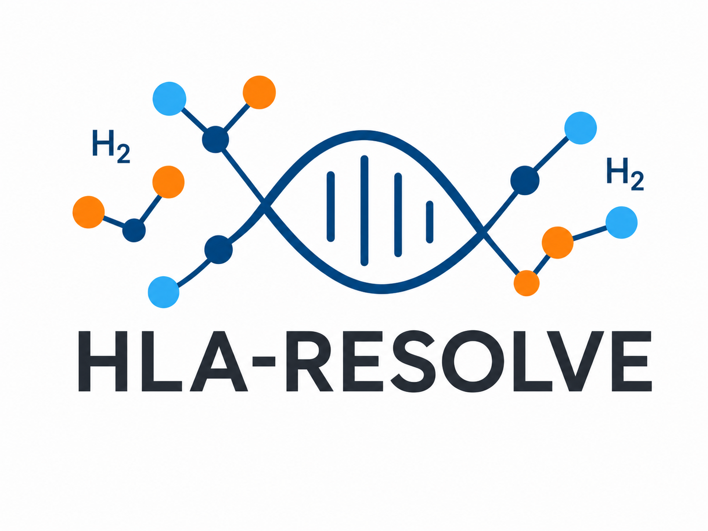

<br/>

<p align="center">
  <picture>
    <source media="(prefers-color-scheme: dark)" srcset="images/hla_resolve.png">
    
  </picture>
  <br/>
  <b>HLA Typing from PacBio Reads</b>
</p>

<p align="center">
  <picture><source media="(prefers-color-scheme: dark)" srcset="https://img.shields.io/github/v/release/matthewglasenapp/hla_resolve?label=version&color=blue"></picture>
  <picture><source media="(prefers-color-scheme: dark)" srcset="https://img.shields.io/badge/platform-linux--64-lightgrey"></picture>
  <picture><source media="(prefers-color-scheme: dark)" srcset="https://img.shields.io/badge/python-3.12-3776AB?logo=python&logoColor=white"></picture>
  <a href="LICENSE.txt"><picture><source media="(prefers-color-scheme: dark)" srcset="https://img.shields.io/badge/license-UCSC%20Noncommercial-green"></picture></a>
  <a href="https://doi.org/10.64898/2026.03.27.26349549"><picture><source media="(prefers-color-scheme: dark)" srcset="https://img.shields.io/badge/medRxiv-10.64898-b31b1b"></picture></a>
</p>

<br/>

<p align="center">
  <a href="#installation"></a>
  &nbsp;&nbsp;&nbsp;&nbsp;
  <a href="#quick-start-and-demo"></a>
  &nbsp;&nbsp;&nbsp;&nbsp;
  <a href="#technical-reference"></a>
  &nbsp;&nbsp;&nbsp;&nbsp;
  <a href="#validated-wgs-libraries"></a>
  &nbsp;&nbsp;&nbsp;&nbsp;
  <a href="#citation"></a>
</p>

<h4 align="center">
  <a href="https://github.com/matthewglasenapp">Matthew Glasenapp</a> &nbsp;·&nbsp;
  <a href="https://github.com/FlyingFish800">Alex Symons</a> &nbsp;·&nbsp;
  <a href="https://github.com/oeco28">Omar Cornejo</a>
</h4>

<br/>

## Introduction

HLA-Resolve is a command-line tool for high-resolution HLA typing from high-coverage PacBio sequencing reads. It reconstructs phased, full-gene sequences for the eight classical HLA loci (HLA-A, -B, -C, -DPA1, -DPB1, -DQA1, -DQB1, -DRB1) and queries the [IPD-IMGT/HLA database](https://www.ebi.ac.uk/ipd/imgt/hla/) to assign HLA allele calls.

HLA-Resolve was designed for and fully validated on PacBio hybrid-capture libraries (read N50 ~4 kb). WGS support has been validated on PacBio whole-genome sequencing reads from the GIAB and HPRC benchmarks (see [Validated WGS Libraries](#validated-wgs-libraries)). HLA-Resolve has not been tested on amplicon sequencing data yet. 

> [!IMPORTANT]
> HLA-Resolve is pre-release software in active development. It is intended for high-coverage PacBio reads. A gene is typed only if its peptide-binding domain reaches at least 8× mean coverage depth.
>
> ONT support is still in development, and `--platform ont` is rejected at runtime until it lands.
>
> The software is for research use only and not for use in diagnostic procedures. The HLA-Resolve [manuscript](https://doi.org/10.64898/2026.03.27.26349549) is under peer review.

<br/>

<details>
<summary><b>Table of Contents</b></summary>

- [Introduction](#introduction)
- [Tool Overview](#tool-overview)
  - [Input](#input)
  - [Output(s)](#outputs)
  - [Runtime and Required Resources](#runtime-and-required-resources)
- [Requirements](#requirements)
- [Installation](#installation)
- [Updating](#updating)
- [Quick Start and Demo](#quick-start-and-demo)
  - [Minimal Command](#minimal-command)
  - [Demo](#demo)
- [Technical Reference](#technical-reference)
- [Validated WGS Libraries](#validated-wgs-libraries)
- [Planned Features (In Development)](#planned-features-in-development)
- [Citation](#citation)
- [Support](#support)
- [License](#license)

</details>

---

## Tool Overview

### Input

<table>
<tr><td><b>Reads</b></td><td>A raw, single-sample (demultiplexed) PacBio sequencing file</td></tr>
<tr><td><b>Format</b></td><td>FASTQ or unmapped BAM, compressed or uncompressed</td></tr>
</table>

### Output(s)

#### Primary Results

HLA allele calls for the following eight genes:

<table>
<tr><td><b>Class I</b></td><td>HLA-A, HLA-B, HLA-C</td></tr>
<tr><td><b>Class II</b></td><td>HLA-DPA1, HLA-DPB1, HLA-DQA1, HLA-DQB1, HLA-DRB1</td></tr>
</table>

**Example Output**

<table>
<tr>
<th>sample</th>
<th>HLA-A_1</th>
<th>HLA-A_2</th>
<th>HLA-B_1</th>
<th>HLA-B_2</th>
<th>...</th>
</tr>
<tr>
<td>HG002</td>
<td>HLA-A&#42;01:01:01:01</td>
<td>HLA-A&#42;26:01:01:01</td>
<td>HLA-B&#42;38:01:01:01</td>
<td>HLA-B&#42;35:08:01:01</td>
<td>...</td>
</tr>
</table>

The calls are written to `<output_dir>/<sample>/hla_typing_results/`, one row per sample.

> [!NOTE]
> Allele order within each gene is arbitrary and is not consistent between genes.

Three output files hold the same calls at different levels of resolution.

| Resolution | Best Guess | Ambiguities Reported |
|------------|------------|----------------------|
| G group | `g_group_output.csv` | `g_group_output_full.csv` |
| Three field | `3_field_allele_output.csv` | `3_field_allele_output_full.csv` |
| Four field | `allele_output.csv` | `allele_output_full.csv` |

The Best Guess file forces a single best guess for every allele. The Ambiguities Reported file gives the calls as genotype list strings when multiple candidate alleles cannot be distinguished at the sequence level.

#### Intermediate Files

- Haplotagged, mapped BAMs for chromosome 6
- Phased VCFs (chromosome 6 and individual gene)
- Nucleotide sequences (FASTA) for each HLA gene

### Runtime and Required Resources

Runtime depends heavily on input file size and available compute resources. Target capture data typically completes in **<15 minutes** using **6 CPUs and 20 GB RAM**. Runtime increases for high-coverage WGS datasets, as all reads must be mapped to the human reference genome prior to restricting downstream analysis to the HLA region on chromosome 6.

Reference genome alignment is the rate-limiting step and is multithreaded, so increasing the thread count with `--threads` provides the largest runtime reduction, especially for high-coverage WGS inputs. The default number of threads is **6**, or the number of CPUs available if fewer, read from the Slurm allocation where there is one. Memory requirements rise with the thread count, so raise the job's memory alongside `--threads`. `--threads` sets the thread count for the tools HLA-Resolve calls directly. DeepVariant also parallelizes internally, so on a cluster its CPU use is bounded by the job allocation and not by this flag.

---

## Requirements

- **Linux (x86_64)** — Several dependencies (pbmarkdup, hiphase, trgt, pbsv) are distributed as precompiled Linux binaries via Bioconda and are not available for macOS.
- **Conda** and **pip** — Used to install all dependencies (see [Installation](#installation)).

---

## Installation

```bash
git clone https://github.com/matthewglasenapp/hla_resolve
cd hla_resolve        # the repository directory created by the clone above
conda env create -f environment.yml
conda activate hla_resolve
pip install -e .
hla_resolve setup
```
`hla_resolve setup` downloads and builds every required dependency once, up front:

| File | Version | Source |
|------|---------|--------|
| GRCh38 reference genome (no-alt analysis set) | GCA_000001405.15 | NCBI |
| rammap binary | v1.0.0 | GitHub |
| hla.xml ([IPD-IMGT/HLA database](https://github.com/ANHIG/IMGTHLA)) | 3.64.0 | IMGTHLA |
| DeepVariant Singularity image | 1.6.1 | Docker Hub |

> [!NOTE]
> These downloads are large. Ensure sufficient disk space is available in the install directory before the first run.

---

## Updating

Please ensure you are running the latest version. To update an existing installation to the latest version, run `update.sh` from the root of your cloned `hla_resolve` repository:
```bash
chmod a+x update.sh
bash update.sh
```

---

## Quick Start and Demo

### Minimal Command

```bash
hla_resolve \
  --input_file <reads.fastq.gz | reads.bam> \
  --sample_name <sample_name> \
  --platform pacbio \
  --scheme <WGS | WES | hybrid_capture | amplicon> \
  --output_dir <output_dir>
```

### Demo

The repository includes a demo dataset of PacBio HLA hybrid capture sequencing reads from HG002 (Ashkenazi Son), a sample from the GIAB and HPRC benchmarks. Run this from the repository root:

<table>
<tr>
<th align="left">Command</th>
<th align="left">Example Output</th>
</tr>
<tr>
<td valign="top">

```bash
hla_resolve \
  --input_file demo/HG002.hifi_reads.fastq.gz \
  --sample_name HG002 \
  --platform pacbio \
  --scheme hybrid_capture \
  --output_dir test \
  --trim_adapters \
  --adapter_file demo/adapters.fasta \
  --threads 6
```

</td>
<td valign="top">

```text
Sample: HG002

gene       _1            _2
HLA-A      01:01:01:01   26:01:01:01
HLA-B      38:01:01:01   35:08:01:01
HLA-C      04:01:01:06   12:03:01:01
HLA-DPA1   01:03:01:02   01:03:01:04
HLA-DPB1   04:01:01:01   04:01:01:03
HLA-DQA1   03:01:01:01   01:05:01:01
HLA-DQB1   05:01:01:05   03:02:01:01
HLA-DRB1   04:02:01      10:01:01:03

Note: Allele order within each gene is
arbitrary and is not consistent
between genes.

Finished HG002 in 9m 18s (status: ok)
```

</td>
</tr>
</table>

The command will print the final HLA allele calls to STDOUT, along with important logging information, including coverage depth metrics and the paths of intermediate files (e.g., BAM, VCF). Genes that could not be reconstructed are shown as `not_typed`.

The same HLA allele calls are written to `test/HG002/hla_typing_results/`, the primary results directory for this run. It holds the six result files described in [Primary Results](#primary-results), with `allele_output.csv` giving the four-field calls shown above.

The reconstructed sequences that produced those calls are in `test/HG002/hla_fasta_haplotypes/`. `HG002_HLA_haplotypes_gene.fasta` holds the full gene sequences and `HG002_HLA_haplotypes_CDS.fasta` holds the coding sequences (CDS), two records per gene, one for each haplotype.

<details>
<summary><b>Full command-line options</b></summary>

```
usage: hla_resolve [-h] [--version] --input_file INPUT_FILE --sample_name
                   SAMPLE_NAME --platform {pacbio,ont} --scheme
                   {WGS,WES,hybrid_capture,amplicon} --output_dir OUTPUT_DIR
                   [--trim_adapters] [--adapter_file ADAPTER_FILE]
                   [--threads THREADS] [--read_group_string READ_GROUP_STRING]
                   [--clean_up] [--keep_full_bam] [--clair3_model CLAIR3_MODEL]
                   [--verbose] [--quiet]

Run HLA-Resolve

optional arguments:
  -h, --help            show this help message and exit
  --version             show program's version number and exit
  --input_file INPUT_FILE
                        Path to the raw sequencing reads file (default: None)
  --sample_name SAMPLE_NAME
                        Name for this sample. Used for output filenames and
                        the read group (default: None)
  --platform {pacbio,ont}
                        Sequencing platform. Only pacbio is supported; ont is
                        not yet available (default: None)
  --scheme {WGS,WES,hybrid_capture,amplicon}
                        Sequencing scheme (default: None)
  --output_dir OUTPUT_DIR
                        Output directory. Results are written to
                        <output_dir>/<sample_name>/ (default: None)
  --trim_adapters       Enable adapter trimming before processing (default:
                        False)
  --adapter_file ADAPTER_FILE
                        Path to a file with custom adapter sequences
                        (FASTA/FASTQ). If not provided, fastplong auto-
                        detection will be used. (default: None)
  --threads THREADS     Number of threads to use, lowered to the CPU count
                        when fewer are available (default: 6)
  --read_group_string READ_GROUP_STRING
                        Override the parsed read group string (default: None)
  --clean_up            Remove intermediate files (default: False)
  --keep_full_bam       Keep the whole-genome BAM on WGS and WES runs. It is
                        deleted by default once reads are filtered to
                        chromosome 6 (default: False)
  --clair3_model CLAIR3_MODEL
                        Clair3 model name (bundled in SIF). Defaults to
                        r1041_e82_400bps_sup_v500 for ONT and hifi_revio for
                        PacBio. (default: None)
  --verbose             Print detailed per-variant diagnostic output (overlap
                        suppression, RefCall rescue, unphased het records, CDS
                        sanity check) (default: False)
  --quiet               Print only stage headers, warnings, and the final
                        results table. The full log is still written to the
                        log file (default: False)

One-time setup (downloads references, binaries, and images):
  hla_resolve setup

Example run:
  hla_resolve --input_file reads.bam --sample_name HG002 --platform pacbio --scheme hybrid_capture --output_dir out

HLA-Resolve is pre-release software intended for research use only
and not for use in diagnostic procedures.
```

</details>

<details>
<summary><b>Intermediate Files</b></summary>

Intermediate files will be written to the following directories. The user can specify the `--clean_up` option if they do not want intermediate files, such as mapped BAM, phased genotypes (VCFs), or fasta haplotype nucleotide sequences for the HLA genes.

| Directory | Description |
|-----------|-------------|
| `fastq_raw/`              | Raw fastq. Converted from BAM format if input is BAM. Copied from raw file if input is fastq |
| `fastq_trimmed/`          | Fastq reads with adapters/barcodes trimmed, if specified by user. If no trimming is specified, will be a copy of the reads in `fastq_raw/` |
| `mapped_bam/`             | Contains BAM files from reference genome alignments |
| `genotype_calls/`         | Contains the raw small variant genotype calls (`.vcf.gz`). SNVs from bcftools and indels from DeepVariant |
| `structural_variant_vcf/` | Contains the SV genotype calls from pbsv |
| `pbtrgt_vcf/`             | Contains the tandem repeat genotypes from TRGT (PacBio-only) |
| `phased_vcf/`             | Contains phased genotype calls from joint phasing of small variants, structural variants, and tandem repeat genotypes |
| `mosdepth/`               | Contains coverage depth output files from mosdepth for the HLA genes |
| `haploblocks/`            | Contains the phasing status of each HLA gene, both those fully spanned by a haplotype block and those that were not |
| `filtered_vcf/`           | Contains the final, filtered VCF of variants to be applied during fasta haplotype reconstruction |
| `vcf2fasta_out/`          | Contains the vcf2fasta sequence output. For genes with an internal phasing break, this holds the interval that was rebuilt and used for matching rather than the full-gene first pass |
| `hla_fasta_haplotypes/`   | Contains fasta files of full gene and CDS sequences for each HLA gene. At HLA-DQA1, HLA-DQB1, and HLA-DRB1 an accepted re-consensus replaces the sequence here |
| `hla_typing_results/`     | Contains the final results of HLA typing |

</details>

---

## Technical Reference

The [Technical Reference](https://github.com/matthewglasenapp/hla_resolve/blob/main/docs/technical_reference.md) gives the full workflow, the dependencies used at each step, and detailed documentation on the algorithms and decision logic used internally by HLA-Resolve.

---

## Validated WGS Libraries

HLA-Resolve was run on whole-genome PacBio sequencing reads for 39 samples from the Human Pangenome Reference Consortium (HPRC), at a mean coverage of 35.2× across the eight classical HLA genes. Concordance with the reference typings of Lai et al. was **100% at one- through three-field resolution** (610/610 alleles) and **92.8% at four-field resolution** (555/598), with a call rate of 99.4% (620/624).

**[Browse the full benchmark →](docs/wgs_validation.md)**

- Per-sample concordance by field of resolution
- Mean HLA coverage depth by sample
- The raw PacBio input file(s) used for each sample

All inputs are publicly available, so the benchmark can be reproduced end to end.

---

## Planned Features (In Development)

| | Feature |
|---|---------|
| 1 | HLA typing at P-group resolution |
| 2 | HLA typing for additional HLA Class I protein-coding genes and pseudogenes<br>(HLA-E, HLA-F, HLA-G; HLA-H, HLA-J, HLA-K, HLA-L, HLA-S, HLA-V, HLA-W) |
| 3 | HLA typing for additional HLA Class II protein-coding genes<br>(HLA-DRB3, HLA-DRB4, HLA-DRB5) |

---

## Citation

If you use HLA-Resolve, please cite:

> Glasenapp, M.R., Yee, M.-C., Symons, A.E., Cornejo, O.E. & Garcia, O.A. HLA-Resolve: High-Resolution HLA Haplotyping Using Long-Read Hybrid Capture. *medRxiv* (2026). https://doi.org/10.64898/2026.03.27.26349549

---

## Support

Questions, bug reports, and feature requests are welcome. Please [open an issue](https://github.com/matthewglasenapp/hla_resolve/issues) on GitHub.

---

## License

HLA-Resolve is released under the [UC Santa Cruz Noncommercial License](LICENSE.txt).
