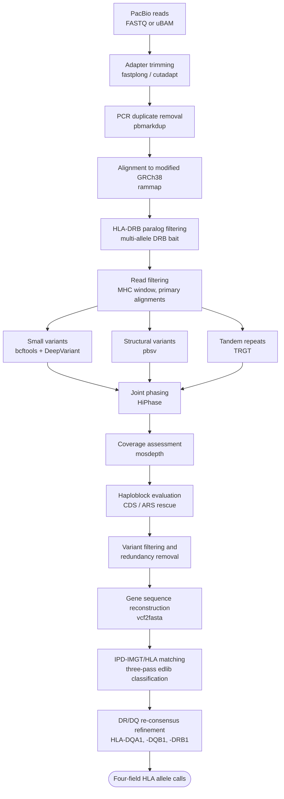

# HLA-Resolve Technical Reference

Detailed documentation on the algorithms, decision logic, and tools used by HLA-Resolve.

## Contents

1. [Workflow and Dependencies](#1-workflow-and-dependencies)
2. [Small Variant Calling and Preparing the Phased VCF for vcf2fasta](#2-small-variant-calling-and-preparing-the-phased-vcf-for-vcf2fasta)
3. [HLA-DRB Paralog Handling](#3-hla-drb-paralog-handling)
4. [Notes on the Use of vcf2fasta](#4-notes-on-the-use-of-vcf2fasta)
5. [Phasing Decision Tree](#5-phasing-decision-tree)
6. [Allele Classification Methodology (`hla_typer.py`)](#6-allele-classification-methodology-hla_typerpy)
7. [DR/DQ Read Re-consensus](#7-drdq-read-re-consensus)

---

## 1. Workflow and Dependencies

HLA-Resolve takes raw PacBio reads (FASTQ or uBAM) as input and executes the following steps to produce four-field HLA allele assignments.



### 1.1 Adapter Trimming
HLA-Resolve expects demultiplexed reads, with SMRTbell adapters and sample barcodes removed. PacBio's `lima` is the standard tool for this.

Adapter trimming with `--trim_adapters` is an optional step for residual library preparation adapters that demultiplexing leaves behind, such as transposase mosaic ends or amplicon primers. It is off by default. Reads that are already clean can skip it.

With `--trim_adapters` and no `--adapter_file`, [fastplong](https://doi.org/10.1002/imt2.107) auto-detects and removes adapters. With `--adapter_file`, [cutadapt](https://doi.org/10.14806/ej.17.1.200) trims the sequences you provide. A file with one record uses that sequence as the 5' adapter. A file with two records uses them as the 5' and 3' adapters.

When two adapters are given, HLA-Resolve checks whether the 3' adapter is the reverse complement of the 5' adapter. When it is, the adapters are symmetric, such as Tn5 mosaic ends, and a read shows the same two sequences in either orientation, so scanning the forward strand trims both ends. When the adapters are not symmetric, such as amplicon primers, a reverse-oriented read would go untrimmed, so cutadapt also scans the reverse complement with `--revcomp`.

### 1.2 PCR Duplicate Removal
PCR duplicates are identified and removed from the trimmed reads using [pbmarkdup](https://github.com/PacificBiosciences/pbmarkdup).

### 1.3 Reference Genome Alignment
Deduplicated reads are aligned to a modified GRCh38 reference genome (no-alt analysis set) using [rammap](https://doi.org/10.64898/2026.05.26.726289) (Wang and Li, 2026), a memory-safe Rust reimplementation of [minimap2](https://doi.org/10.1093/bioinformatics/bty191) that produces identical alignments. The modified reference includes an additional scaffold containing the HLA-Y/HLA-OLI insertion to prevent mismapping of HLA-Y reads to HLA-A.

### 1.4 HLA-DRB Paralog Filtering
A separate alignment step maps reads against a multi-allele HLA-DRB bait (`DRB_reference.fa`) of 33 sequences. These are 13 HLA-DRB1, 3 HLA-DRB3, and 1 HLA-DRB4 allele from IPD-IMGT/HLA, the HLA-DRB5, -DRB6, and -DRB9 sequences from GRCh38, HLA-DRB7 and -DRB8 from the SSTO haplotype, one element from CM089004.1, and 10 paralog and intergenic blocks lifted from HPRC assemblies, most with their own HLA-DRB1 copy masked so that they compete only for paralog reads. Reads whose primary alignment lands on anything other than an HLA-DRB1 allele are flagged for removal. On every PacBio scheme the bait is applied to the reads already placed in the DR cluster (chr6:32439878-32589848) by the GRCh38 alignment, not to the whole read set. The aim is to reclassify reads that mapped into the DR region, not to rehome unmapped reads, and the restriction keeps genome-wide homology noise out of the kill list. Because a read is selected whenever it overlaps that window, every read capable of contributing to HLA-DRB1 variant calling is classified.

### 1.5 Read Filtering
Aligned reads are filtered to the MHC window on chromosome 6 (chr6:28000000-34000000), keeping only primary alignments. Reads flagged as HLA-DRB1 paralogs in step 4 are removed.

### 1.6 Small Variant Calling
SNVs are called with [bcftools](https://doi.org/10.1093/bioinformatics/btr509) and indels are called with [DeepVariant](https://doi.org/10.1038/nbt.4235). DeepVariant is run over chr6:29900000-33150000 rather than all of chromosome 6. The window spans all eight typed genes with margin. Because DeepVariant supplies only the indels, RefCall rescue is applied to indel records: they are rescued at DP ≥ 30 with alt allele depth ≥ 10, and reclassified as heterozygous at VAF 0.3 to 0.7 or homozygous ALT above 0.7.

### 1.7 Structural Variant Calling
Structural variants are called from the aligned reads using [pbsv](https://github.com/PacificBiosciences/pbsv).

### 1.8 Tandem Repeat Genotyping
Tandem repeats within the HLA region are genotyped using [TRGT](https://doi.org/10.1038/s41587-023-02057-3).

### 1.9 Joint Phasing
Small variants, structural variants, and tandem repeat genotypes are jointly phased with [HiPhase](https://doi.org/10.1093/bioinformatics/btae042), producing haplotagged BAMs, phased VCFs, and haplotype block coordinates.

### 1.10 Coverage Assessment
Per-gene coverage depth and breadth are calculated with [mosdepth](https://doi.org/10.1093/bioinformatics/btx699). Genes failing minimum coverage thresholds are excluded from HLA typing.

### 1.11 Haploblock Evaluation
Phased haplotype blocks are evaluated to determine whether each HLA gene is fully spanned by a single phase set. Genes with internal phasing breaks enter a rescue pipeline that attempts to recover coding sequence or antigen recognition sequence (ARS) haplotypes.

### 1.12 Variant Filtering and Redundancy Removal
Phased genotypes are filtered by gene to remove redundant calls from overlapping variant callers (e.g., DeepVariant indels overlapping pbsv structural variants, or non-TRGT variants within TRGT tandem repeat regions). Symbolic and complex structural variant types (BND, INV, DUP) are excluded.

### 1.13 Gene Sequence Reconstruction
Phased, filtered genotypes are applied to GRCh38 gene models using [vcf2fasta](https://github.com/santiagosnchez/vcf2fasta) to reconstruct full-gene and coding-sequence haplotype FASTA files for each HLA gene.

A small number of HLA-DPB1 alleles, including DPB1\*13:01, \*27:01, \*107:01, and \*135:01, are one base shorter than GRCh38 in a poly-A run at the very end of the coding sequence. Because vcf2fasta works in reference coordinates, the annotated CDS window ends one base short of the shifted stop codon and the haplotype comes back without a stop. When this happens, HLA-Resolve re-extracts the coding sequence with the final exon extended by a few reference bases and trims each haplotype back to its first in-frame stop. The repair is accepted only if that stop falls within a few bases of the expected CDS length, otherwise the original sequence is kept.

### 1.14 IPD-IMGT/HLA Database Matching
Reconstructed haplotypes are compared against alleles in the [IPD-IMGT/HLA database](https://doi.org/10.1093/nar/gkac1011) with a three-pass hierarchical classification algorithm using [edlib](https://doi.org/10.1093/bioinformatics/btw753):

   1. **G-group assignment** — The antigen recognition sequence (ARS exons) is matched to G-group reference sequences by edit distance. An exact match is required.
   2. **Three-field allele assignment** — The full concatenated exon sequence is compared against alleles within the assigned G group, ranked by edit distance.
   3. **Four-field refinement** — The full-gene haplotype (including introns and UTRs) is compared against candidate alleles, ranked by mismatch identity (the proportion of matching bases at 1:1-aligned positions), which avoids penalizing insertions and deletions from unreliable intronic reconstruction. Ties are broken by match length, then by raw edit distance, then by lowest fourth-field value, with each tier applied only to the candidates the previous tier could not separate.
   4. **DR/DQ re-consensus refinement** — HLA-DQA1, HLA-DQB1, and HLA-DRB1 reconstruct poorly in their noncoding sequence, which makes the fourth field from pass 3 unreliable. For these three genes the fourth field is re-derived from the reads themselves. The reads over each gene are re-mapped to the best-guess allele, a consensus is rebuilt for each haplotype, and that consensus is re-matched against the fourth-field options within the same three-field group. The re-match scores the exon and intron sequence only, and any tie it cannot resolve is broken over the untranslated regions trimmed to the span shared by all tied candidates, so no allele can win merely by having a longer database record. The three-field call never changes and no other gene is affected. Accepted haplotypes also have their reconstructed FASTA sequence replaced by the re-consensus sequence. See [Section 7](#7-drdq-read-re-consensus) for details.

### Note
For WGS and WES input, the pipeline skips adapter trimming (step 1.1) and pre-alignment duplicate removal (step 1.2).

---

# Additional Workflow Details

The sections below expand on the steps in the workflow above.

---

## 2. Small Variant Calling and Preparing the Phased VCF for vcf2fasta

### Small variant calling

SNVs are called with bcftools and indels with DeepVariant. This pairing is fixed: `cli.py` assigns it for `--platform pacbio` and it is not user-configurable. bcftools is run over `chr6:28000000-34000000`; DeepVariant is run over the narrower `chr6:29900000-33150000` rather than all of chromosome 6. That window spans all eight typed genes with margin and keeps runtime down. No gVCF is produced.

The two call sets are merged by taking only SNV records from bcftools and only indel records from DeepVariant. Records typed as neither, such as MNPs and complex substitutions, are not carried into the merged VCF.

DeepVariant is conservative in the HLA region and filters real variants as RefCall. Those records are reviewed and overturned to PASS when the evidence supports them. Because DeepVariant supplies only the indels, the rescue is applied to indel records alone; RefCall SNVs are never rescued, since DeepVariant's SNVs are discarded by the merge in any case. A RefCall indel qualifies when its depth is at least 30 and the alternate allele is supported by at least 10 reads. The genotype is then set from the variant allele frequency, heterozygous between 0.3 and 0.7 and homozygous ALT above 0.7. Records that pass on two alternate alleles are written as compound heterozygotes. Rescued records are written to `SAMPLE.dv.rescued.vcf.gz`, and `--verbose` prints each one.

### Preparing the phased VCF

Following phasing with HiPhase or longphase, the SNV and SV VCFs are merged and normalized with bcftools. The following steps are taken to prepare the VCF records for use with vcf2fasta.
1. Filter the joint phased VCF by gene. The gene coordinates are defined by the GRCh38 GFF3 records.

2. Send all symbolic variants to SAMPLE_GENE.symbolic.vcf.gz. These variant types (e.g., TRID, BND, DUP, INV) are not currently compatible with vcf2fasta. These variants will not participate in quality filtering or be used downstream, but are kept for record.

3. Suppress indels overlapping PASS pbsv structural variants (haplotype-aware). This step addresses the known gray area in variant size and representation where small-variant genotypers and structural-variant genotypers may both emit overlapping calls for the same underlying insertion/deletion, leading to redundant or conflicting genotypes in the merged VCF. During per-gene post-phasing filtering, the pipeline identifies PASS pbsv structural variants and evaluates overlap with indels from bcftools or DeepVariant.

    An indel is suppressed when it is phased or homozygous, its reference footprint overlaps that of a pbsv structural variant, and the two are carried on the same haplotype. No minimum indel size applies to this check: pbsv is run with `--min-sv-length 20`, so an overlapping indel of any size falls inside a structural event whose allele already accounts for those bases. A second, non-overlapping check suppresses indels of at least 50 bp that begin within 10 bp of a structural variant, which catches the same underlying event left-aligned differently by the two callers. SNPs are never suppressed, since a real substitution can sit next to a structural variant breakpoint.

    Indel size and type are read from the alleles the sample actually carries rather than from the first ALT, so a multiallelic record carrying both a SNP allele and an indel allele is still recognized as an indel. This logic is applied only to pbsv SV genotypes that are non-symbolic, FILTER=PASS, and phased or homozygous alternate. Suppressed indels are written to SAMPLE_GENE_SV_OVERLAP.vcf.gz. These records are excluded from downstream processing (including vcf2fasta).

4. Suppress heterozygous genotypes that fall inside a homozygous deletion. A base that is homozygously deleted is absent from both haplotypes, so any heterozygous genotype called at that position cannot be real. These are typically low-depth calls in repetitive regions resulting from reads that misaligned across a deletion. The pipeline scans the per-gene, region-filtered joint VCF and identifies records where the sample is homozygous for an ALT allele shorter than REF. These are the small-variant calls present in the merged VCF. The pbsv deletions are handled separately (step 3), and TRGT repeat deletions are covered by the tandem-repeat overlap check. Any heterozygous genotype whose position falls inside one of these deletions is suppressed: the record is written to SAMPLE_GENE_SV_OVERLAP.vcf.gz and excluded from downstream processing. This step does not affect phasing classification. The heterozygous count that determines phasing status is computed upstream in `parse_haploblocks()`, while this suppression happens later in `filter_vcf_gene()` and only cleans the per-gene VCF that feeds haplotype reconstruction.

5. Sort all non-symbolic variants into QC-pass (SAMPLE_GENE_PASS.vcf.gz) and QC-fail (SAMPLE_GENE_FAIL.vcf.gz). The thresholds that govern the SNVs are applied earlier, in the bcftools calling command itself (QUAL ≥ 10, GQ ≥ 20, and DP ≥ 2); by the time a bcftools record reaches this step it has already cleared them, so it is passed through without re-testing. DeepVariant indels are sorted here on FILTER=PASS, with no additional QUAL, GQ, or DP threshold. Pbsv non-symbolic SV genotypes (e.g., insertion, deletion) are likewise sorted on FILTER=PASS. TRGT records carry explicit REF/ALT allele sequences and bypass quality filtering entirely.

6. Count heterozygous genotypes to address the edge case of a single heterozygous genotype that is unphased. If a gene's only heterozygous genotype is unphased, it is retained in the QC-pass phased genotype VCF rather than discarded: with one heterozygous site, which haplotype receives which allele is arbitrary, but the reconstructed pair is still correct.

7. Filter the QC-pass genotypes (SAMPLE_GENE_PASS.vcf.gz) to remove unphased heterozygous genotypes. The QC-pass genotypes with unphased heterozygous genotypes removed are written to SAMPLE_GENE_PASS_phased.vcf.gz. Unphased heterozygous genotypes are written to SAMPLE_GENE_PASS_UNPHASED.vcf.gz. Genes that entered CDS rescue, and the single-unphased-heterozygote case in step 6, keep all their genotypes and send nothing to the UNPHASED file. The split is decided per record from the parsed genotype and its phase flag, so every heterozygous combination at a multiallelic site is handled, not just the common biallelic ones.

8. Both symbolic genotypes and unphased QC-pass heterozygous genotypes that overlap an HLA gene will be reported. These records cannot be incorporated into the vcf2fasta haplotype reconstruction, but may confer important information.

---

## 3. HLA-DRB Paralog Handling

The HLA Class II regions contains a cluster of HLA-DRB paralogs with high sequence identity to HLA-DRB1. HLA-Resolve applies specialized handling to prevent sequencing reads from paralogs of HLA-DRB1 from contaminating HLA-DRB1 variant calling and phasing. 

1. **HLA-DRB5 and HLA-DRB6 hard-masking** (`ensure_reference_genome()` in `config.py`). An augmented GRCh38 reference FASTA is built in one step. HLA-DRB5 (chr6:32517353-32530287) and HLA-DRB6 (chr6:32552713-32560022) are hard-masked with `bedtools maskfasta`. Masking forces divergent HLA-DRB1 reads to anchor at HLA-DRB1 rather than losing MAPQ and coverage to a paralog locus. HLA-DRB5 draws HLA-DRB1\*07 and \*09 reads, and HLA-DRB6 draws divergent DR4 alleles such as HLA-DRB1\*04:12. Genuine HLA-DRB5 and HLA-DRB6 reads are still recognized, because both sequences remain in the competitive bait below.

2. **Multi-allele competitive classifier** (`classify_DRB_reads()` in `preprocess_methods.py`). Reads are re-aligned against `DRB_reference.fa`, a bait of 33 sequences. These are 13 HLA-DRB1, 3 HLA-DRB3, and 1 HLA-DRB4 allele from IPD-IMGT/HLA, HLA-DRB5, -DRB6, and -DRB9 from GRCh38, HLA-DRB7 and -DRB8 from the SSTO haplotype, one element from CM089004.1, and 10 paralog and intergenic blocks lifted from HPRC assemblies. Most of the HPRC blocks carry their own HLA-DRB1 copy masked, so that they compete only for paralog reads. Any read whose primary alignment is not to a `DRB1*` sequence is flagged for removal by `filter_reads()`.

    On every PacBio scheme the classifier is applied only to primary reads already placed in the DR cluster (`drb_region`, chr6:32439878-32589848) by the GRCh38 alignment, never to the whole read set. The goal is to reclassify reads that mapped into the DR region, not to rehome unmapped reads, and the restriction keeps genome-wide homology noise out of the kill-list.

    The window ends at the 3' end of HLA-DRB1. This is not a coverage gap: reads are selected by overlap, so a read that begins inside the window and extends past it is still classified, and a read lying entirely downstream cannot contribute to HLA-DRB1 variant calling in the first place. The kill-list itself is applied genome-wide within the MHC by `filter_reads()`, so a flagged read is removed everywhere, not only where it was classified.

3. **MHC read filtering** (`filter_reads()` in `preprocess_methods.py`). Aligned reads are restricted to `chr6:28000000-34000000`, secondary and supplementary records are dropped, and the paralog kill-list from step 2 is removed.

---

## 4. Notes on the Use of vcf2fasta

HLA-Resolve uses a forked version of vcf2fasta, originally written by Santiago Sanchez-Ramirez (https://github.com/santiagosnchez/vcf2fasta, MIT license). The fork is maintained at https://github.com/matthewglasenapp/vcf2fasta and is installed as a pip dependency via `environment.yml`. The fork includes several bug fixes described below.

### CDS ordering and GFF preprocessing

vcf2fasta concatenates CDS records in the order they appear in the GFF file, then applies reverse complement for minus strand genes. To ensure correct ordering, `supplementary_scripts/sort_cds.py` extracts CDS records from the raw GRCh38 GFF3 annotations and sorts them by genomic coordinate (low to high). The pre-sorted GFF3 files are included in `hla_resolve/data/hla_gff`. In that directory, `hla_<gene>.gff3` is the unaltered annotation from GRCh38.p14, and `hla_<gene>_cds_sorted.gff3` is the CDS-only sorted version used as input for vcf2fasta. `hla_<gene>_gene.gff3` contains the gene-level record used for full-gene reconstruction.

### Forced phased mode

vcf2fasta checks the first genotype of the overall VCF to determine phase status. If the first variant is unphased, it treats the whole VCF as unphased and outputs one diploid sequence with IUPAC codes representing heterozygous bases. The fork hardcodes vcf2fasta to operate in "phased" mode. The HLA-Resolve pipeline ensures this is appropriate, as it first ensures each gene is completely spanned by a haplotype block, and features special treatment for genes that have incomplete phasing.

```diff
- phased = v2f_helper.getPhased(vcf)
- if not phased:
-     print('No phased genotypes found on first variant. Treating as "unphased"')
- else:
-     print('Phased genotypes found on first variant. Treating as "phased"')
+ # Patch: forcibly treat all input as phased
+ phased = True
+ print('Treating as "phased"')
```

When vcf2fasta treats a VCF as "phased," it treats unphased heterozygous genotypes as phased and arbitrarily assigns each allele to a haplotype. This means that unphased heterozygous genotypes must be removed from the phased VCF prior to running vcf2fasta. However, if there is only one heterozygous genotype in the single-gene VCF and it remains unphased, it should not be filtered before vcf2fasta. Because we care only about phased haplotypes within genes, it doesn't matter which haplotype gets which allele in this scenario. The two reconstructed haplotypes will be correct. However, the standard pipeline removes unphased heterozygous genotypes from the VCF before vcf2fasta, because when operating in "phased" mode, if there is a mix of phased and unphased heterozygous genotypes, vcf2fasta randomly assigns alleles from the unphased heterozygous genotypes to haplotypes, resulting in inevitable switch errors. The edge case of a single unphased heterozygous genotype is addressed in `reconstruct_fasta_methods.py`.

### Terminal stop codon repair for HLA-DPB1

A small number of HLA-DPB1 alleles, including DPB1\*13:01, \*27:01, \*107:01, and \*135:01, are one base shorter than GRCh38 in a poly-A run at the very end of the coding sequence. vcf2fasta works in reference coordinates, so the annotated CDS window ends one base short of the shifted stop codon. The haplotype comes back 776 bp ending in ATA instead of 777 bp ending in TAA. The allele is functional, and the annotation is correct, so neither the GFF nor the database is at fault.

`extract_cds_padded_and_trim()` in `reconstruct_fasta_methods.py` repairs this. The CDS GFF is rewritten with its 3'-terminal exon extended by 5 reference bases, chosen strand-aware, vcf2fasta is re-run on the padded model in a temporary directory, and each haplotype is trimmed back to its first in-frame stop codon. The repair is accepted only if that stop lands within 5 bp of the annotated CDS length, which rejects premature stops and cases where nothing was recovered near the terminus. A rejected haplotype keeps its original sequence.

The repair is scoped to HLA-DPB1 and runs only when a haplotype does not already end in a stop codon. Genes that went through the CDS rescue pipeline, or that are unphased, are skipped, since their CDS records are deliberately partial. The persisted `vcf2fasta_out/` directory is left untouched.

### Bug fixes in the fork

1. **`getPloidy()` and `getPhased()` robustness**: Originally, both functions relied on the first variant record to infer ploidy and phasing status. If that first record contained missing genotypes or was of an unexpected format, the program exited with an error. The updated versions iterate through the VCF until they encounter a valid genotype.

    **`getPloidy()` (`v2f/functions.py`):**

    ```diff
    - def getPloidy(vcf):
    -     var = [ y for x,y in next(vcf.fetch()).samples.items() ]
    -     p = [ len(v.get('GT')) for v in var if v.get('GT')[0] is not None ]
    -     return p[0]
    + def getPloidy(vcf):
    +     for rec in vcf.fetch():
    +         for sample in rec.samples.values():
    +             gt = sample.get('GT')
    +             if gt and all(g is not None for g in gt):
    +                 return len(gt)
    +     # Default to diploid if no variants found (empty VCF)
    +     return 2
    ```

    **`getPhased()` (`v2f/functions.py`):**

    ```diff
    - def getPhased(vcf):
    -     var = [ y for x,y in next(vcf.fetch()).samples.items() ]
    -     p = any([ not v.phased for v in var ])
    -     return not p
    + def getPhased(vcf):
    +     for rec in vcf.fetch():
    +         for sample in rec.samples.values():
    +             gt = sample.get('GT')
    +             if gt and all(g is not None for g in gt):
    +                 return sample.phased
    +     raise ValueError("No phased genotypes found to determine phasing.")
    ```

2. **Right-to-left variant application**: The original indel-handling code applied variants from low to high genomic coordinates using a running offset to adjust positions after insertions and deletions. This can break when a SNP and an indel overlap, causing the indel to be skipped. The fix removes the shifting offset and applies variants from right to left (highest to lowest coordinate).

    **`getSequences()` (`v2f/functions.py`):**

    ```diff
    -        posadd = 0
    -        for vrec in vcf.fetch(chrom, start, end):
    -            pos = vrec.pos - start - 1 + posadd
    -            alleles, max_len = getAlleles(vrec, ploidy, phased, args.addref)
    -            ref_len = len(vrec.ref)
    -            for sample in alleles.keys():
    -                tmpseqs[sample] = UpdateSeq(alleles, sample, pos, ref_len, tmpseqs[sample])
    -            posadd += (max_len - ref_len)
    +        vrec_list = list(vcf.fetch(chrom, start, end))
    +        vrec_list.sort(key=lambda r: r.pos, reverse=True)
    +
    +        for vrec in vrec_list:
    +            pos = vrec.pos - start - 1
    +            alleles, max_len = getAlleles(vrec, ploidy, phased, args.addref)
    +            ref_len = len(vrec.ref)
    +            for sample in alleles.keys():
    +                tmpseqs[sample] = UpdateSeq(
    +                    alleles,
    +                    sample,
    +                    pos,
    +                    ref_len,
    +                    tmpseqs[sample]
    +                )
    ```

3. **Empty VCF handling**: The original code attempted to get sample names from the first variant record, which fails with a `StopIteration` error when the VCF has no variants. The fix retrieves sample names from the VCF header, which is always present.

    **`cli.py`:**

    ```diff
    - samples = v2f_helper.get_samples(vcf)
    + # Get a list of samples from header (works even if VCF has no variants)
    + samples = list(vcf.header.samples)
    ```

4. **Default ploidy for empty VCFs**: `getPloidy()` returns a default ploidy of 2 (diploid) when the VCF contains no variants, rather than raising an error. This allows vcf2fasta to output reference sequences for genes with no variants. (See `getPloidy()` diff above.)

### Additional vcf2fasta notes

1. Multiple transcripts exist for all HLA genes in the hg38 GFF3. If you don't select one, vcf2fasta will make FASTA files for all annotated transcripts.

2. vcf2fasta applies all variants it sees when generating the FASTA. It does not check the FILTER status of records. Therefore, it is important to filter the VCF prior to running vcf2fasta.

3. Before running vcf2fasta in phased mode, you need to ensure that the genes you're making FASTAs for are fully contained within a single phase set. If there are two or more phase sets contained within your gene, it could cause a switch error.

---

## 5. Phasing Decision Tree

### Overview

This section describes the decision tree used to classify genes by phasing status and determine how allele sequences are reconstructed. The logic is implemented across `investigate_haploblocks_methods.py` (classification) and `reconstruct_fasta_methods.py` (VCF filtering and FASTA extraction).

### Decision Tree

1. **Gene has ≤1 het genotype**
   - Classify as `fully_phased`
   - Whitelist the unphased genotype, run vcf2fasta
   - Match to the HLA database with the full vcf2fasta output

2. **Gene fully spanned by single extended haploblock**
   - Classify as `fully_phased`
   - Remove unphased genotypes, run vcf2fasta
   - Match to the HLA database with the full vcf2fasta output

3. **Gene NOT fully spanned** — enter rescue mode

   - **a. ARS fully spanned by a single extended haploblock**
     - Find the largest ARS-spanning block
     - Remove unphased genotypes, run vcf2fasta
     - CDS (vcf2fasta --feat CDS):
       - If the CDS is effectively homozygous (<=1 heterozygous genotype in the CDS), write the full concatenated exon output **untrimmed** to `_CDS.fasta`. The confidently phased haploblock need not span every exon, and it may exclude an exon that distinguishes competing alleles. Trimming the CDS to the haploblock would discard that discriminating sequence. When the coding sequence is homozygous, phase within the CDS is irrelevant, so the full CDS is used.
       - If there is >1 heterozygous genotype in the CDS, restrict the CDS to the haploblock.
     - Gene (vcf2fasta --feat gene): restrict to the haploblock coordinates.
     - Match to the HLA database with these sequences.

     Note. To restrict a gene interval or a CDS to a region, truncate the GFF to that region and run vcf2fasta over it. `extract_interval_vcf2fasta` does the gene and `extract_cds_subset_vcf2fasta` does the CDS. Every subset in 3a and 3b works this way.

   - **b. ARS NOT spanned** — CDS-aware rescue

     Count all QC-pass heterozygous genotypes in the CDS and ARS CDS regions. These come from the existing `gene_het_sites`, which is already filtered by `parse_haploblocks()`.

     - **i. Total CDS hets <= 1**
       - Whitelist all unphased heterozygous genotypes in `filter_vcf_gene`
       - Run vcf2fasta
       - CDS: write full concatenated exon output (vcf2fasta --feat CDS) to `_CDS.fasta`
       - Gene (vcf2fasta --feat gene):
         - If there is 1 CDS heterozygous genotype, anchor on the CDS heterozygous genotype position. In the sorted list of all heterozygous genotype positions in the gene, find the heterozygous genotype immediately before and immediately after the CDS heterozygous genotype. The interval is (prev_het + 1) to (next_het - 1), using gene boundaries as fallback if no prev/next het exists. If this interval fully contains ARS, write to `_gene.fasta`. If not, do not write a record to `_gene.fasta` (no 4th field assignment will be made).
         - If there are zero CDS heterozygous genotypes, all heterozygous genotypes are intronic. Find the largest ARS-overlapping interval containing <=1 heterozygous genotype:
           1. Sort all het positions in the gene: h1, h2, ..., hn
           2. For each het h_i, compute interval_i = [h_(i-1) + 1, h_(i+1) - 1] (gene boundaries as fallback) — this is the maximal region containing only h_i
           3. Filter to intervals overlapping ARS
           4. Pick the largest and restrict the gene to that interval

           If no interval overlaps ARS, do not write gene record. (With <=1 het, phase is irrelevant — vcf2fasta random assignment produces both haplotypes correctly.)

     - **ii. Total CDS heterozygous genotypes > 1**

       - **A. ARS CDS hets <= 1**
         - Whitelist all heterozygous genotypes in `filter_vcf_gene`
         - Run vcf2fasta
         - CDS: reconstruct only the ARS CDS exons, write to `_CDS.fasta`
         - Gene:
           - Class II: extend ARS (exon 2) outward to the nearest heterozygous genotypes in each direction; write that interval to `_gene.fasta`.
           - Class I: check if any heterozygous genotype exists in intron 2 (gap between the two ARS CDS exons).
             - No intron 2 heterozygous genotype: extend ARS outward to the nearest heterozygous genotype in each direction; write that interval to `_gene.fasta`
             - Heterozygous genotype in intron 2: do not write gene record

       - **B. ARS CDS hets > 1**
         - Classify as `do_not_type_genes` (no HLA typing performed)

---

## 6. Allele Classification Methodology (`hla_typer.py`)

This section describes the allele classification algorithm implemented in `hla_typer.py`, which performs HLA allele assignment after haplotype reconstruction from phased FASTA sequences.

The typing workflow operates downstream of variant calling, phasing, and FASTA reconstruction, and is responsible for assigning HLA alleles at G-group, three-field, and four-field resolution.

---

### 6.1 Reference Data

Reference data are derived from the [IPD-IMGT/HLA](https://www.ebi.ac.uk/ipd/imgt/hla/) database, pinned to release 3.64.0 so that calls are reproducible across installs.

The XML reference file (`hla.xml`) is parsed to extract:
- Allele nucleotide sequences
- Exon, intron, and UTR annotations
- Peptide-binding domain definitions
- G-group membership metadata

Records whose feature annotation is partial are dropped as the database is read, so the search space holds only alleles with a complete, contiguous feature set from the 5' UTR through the 3' UTR. Partially sequenced entries, such as the many exon-2-only and exon-2-plus-3 records, cannot be compared against a reconstructed full-gene haplotype and are not candidates for assignment.

This metadata is used to:
- Reconstruct reference exon and full-gene sequences
- Generate allele lookup tables by G group
- Validate that all alleles within a G group share identical peptide-binding domain sequences

---

### 6.2 Inputs to the Typing Algorithm

The typing script consumes three primary inputs, all generated by upstream stages of the HLA-Resolve pipeline:

1. **IMGT/HLA reference database**
   - XML format (`hla.xml`)
   - Contains all reference allele sequences and annotations

2. **Concatenated exon FASTA**
   - Required input
   - Contains reconstructed, phased exon sequences for each sample allele
   - Used for G-group assignment and three-field typing

3. **Full-gene FASTA (optional)**
   - Includes introns and UTRs
   - Enables refinement to four-field resolution
   - If not provided, four-field typing is skipped

The pipeline will run successfully with exon-only FASTA input, but accurate four-field assignments require full-gene sequence data.

---

### 6.3 Typing Outputs

The typing program produces both CSV result files and detailed log files documenting classification decisions.

#### Primary Output Files

- **`g_group_output.csv`**
  G-group classification for each allele.
  Unassigned entries are left blank.
  Alleles are formatted using standard HLA nomenclature (without the `HLA-` prefix).

- **`3_field_allele_output.csv`**
  Three-field–accurate allele assignments for each sample.
  Includes a placeholder fourth field for compatibility with reference-matching tools.
  These fourth-field values do **not** necessarily reflect true four-field assignments.

- **`allele_output.csv`**
  Final four-field–accurate allele assignments (when full-gene sequence data are provided).
  Uses standard HLA nomenclature including the `HLA-` prefix.

In all three files, the two columns for a gene stay in haplotype-record order, so that column 1 corresponds to the `_1` record of the deposited haplotype FASTA and column 2 to the `_2` record. They are no longer sorted alphabetically within a gene. Grading a genotype is order independent, and keeping record order lets a call be traced back to the sequence it came from.

Each of the three files has a companion `_full.csv` (`g_group_output_full.csv`, `3_field_allele_output_full.csv`, `allele_output_full.csv`) that reports every equidistant option as a genotype list string rather than the single chosen call.

#### Log Files

- **`g_group_assignment.log`**
  Records whether G-group assignment succeeded for each allele, including edit distance values.

- **`3_field_allele_assignment.log`**
  Logs the assignment metric used, metric values, and any equidistant candidate alleles.

- **`allele_assignment.log`**
  Documents fourth-field refinement logic, including:
  - Whether refinement was attempted
  - Alleles considered during classification
  - Final assignment metrics

#### Auxiliary Data

- **`sample_ref_comp.csv`**
  Per-haplotype comparison of the query sequence against the assigned reference allele, written when the pipeline runs with query-reference comparison enabled. DR/DQ haplotypes that go through re-consensus are omitted, since their pass 3 comparison is superseded.

- **`database_data.json`**
  Serialized reference data for debugging and testing, including:
  - Feature-level sequence data
  - G-group membership tables

---

### 6.4 Hierarchical Classification Strategy

The typing algorithm employs a **three-pass hierarchical approach**:

#### Pass 1: G-group Assignment
- Searches each G group's peptide-binding domain sequence within the query's concatenated exon sequence, in infix mode. There is no step that extracts an ARS from the query; the reference domain is located inside the whole query CDS
- For class II this is exon 2. For class I, exons 2 and 3 are searched independently and their distances summed, so they need not be adjacent or in order
- A G group is assigned only if the total distance is zero, which requires every ARS exon of that group to be present exactly. Sequence outside the ARS exons does not affect the assignment
- If no G group is assigned, the algorithm proceeds with an unrestricted search across the locus

#### Pass 2: Three-field Assignment
- Compares concatenated exon sequences of the query allele against reconstructed exon sequences of candidate reference alleles
- Search space is restricted to the assigned G group when available
- Produces accurate three-field allele assignments

#### Pass 3: Four-field Refinement (optional)
- Performed only if full-gene FASTA input is provided
- Ignores the previously assigned fourth field and searches using a wildcard (e.g., `C*02:02:02:XX`)
- Compares full-gene sequences including introns and UTRs
- Uses mismatch identity rather than raw edit distance

#### Pass 4: DR/DQ Re-consensus Refinement
- Applied to HLA-DQA1, HLA-DQB1, and HLA-DRB1
- Re-maps the reads underlying each call to the best-guess allele, rebuilds a consensus, and re-matches to the fourth-field options within the same three-field group
- Described in full in [Section 7](#7-drdq-read-re-consensus)

---

### 6.5 Assignment Metrics

#### Edit Distance
Similarity in passes 1 and 2 is evaluated with Levenshtein edit distance computed by [edlib](https://github.com/Martinsos/edlib) in infix mode (free end gaps), so the shorter sequence is located within the longer one and end gaps are not penalized.

Pass 1 assigns a G group only at distance zero. Pass 2 ranks candidate alleles within that G group on raw edit distance: haplotype reconstruction over the coding sequence is accurate enough that the correct allele is normally reached at distance zero, so no indel-weighting scheme is applied.

#### Mismatch Identity (Pass 3)
For four-field refinement, the default metric is mismatch identity, the proportion of matching bases among the positions that align one to one: mismatch_identity = matches / (matches + mismatches)

Insertions and deletions are left out of the denominator. Intronic reconstruction is the least reliable part of the haplotype, and its indels are usually artifacts of variant representation rather than real differences from the reference allele. Scoring only substituted positions keeps those artifacts from deciding the call, and it avoids bias toward incomplete reference alleles when comparing noncoding regions.

Ties are broken first by match length, then by raw edit distance, then by the lowest fourth field, compared numerically so that a three-digit fourth field is not ranked ahead of a two-digit one. Each tier runs only on the candidates the previous tier could not separate, so no tier can overturn an earlier decision.

---

### 6.6 Reference Sequence Reconstruction

Reference exon and full-gene sequences are reconstructed dynamically using annotation metadata from `hla.xml`.

This includes:
- Ordered exon concatenation
- Intron and UTR integration for full-gene sequences
- Peptide-binding domain extraction

Sanity checks ensure consistency between G-group definitions and peptide-binding domain sequences.

---

## 7. DR/DQ Read Re-consensus

HLA-DQA1, HLA-DQB1, and HLA-DRB1 reconstruct poorly enough in their intronic and UTR sequence that the pass 3 full-gene comparison often lands on the wrong fourth field. For these three genes only, the fourth field is re-derived from the reads themselves. The three-field lineage from pass 2 is never changed, and no other gene is touched. The step is implemented in `reconsensus_drdq.py`, gated by `reconsensus_drdq` in `config.py`, and runs for PacBio only.

For each gene the pipeline takes the two pass 3 calls, pulls the reads over the gene window from the haplotagged BAM, and rebuilds a consensus for each haplotype against an IPD-IMGT/HLA reference sequence. Each consensus is then re-matched by edit distance against every fourth-field option inside its own three-field group, using the exon plus intron core rather than the full sequence, so that unreliable UTR reconstruction cannot decide the call.

When the core cannot separate two or more fourth-field candidates, the comparison is repeated over the untranslated regions trimmed to the span shared by every tied candidate, so each is scored across an identical interval. Anything still tied goes to the lowest fourth field.

The gene window comes from the span of the gene's filtered VCF plus 3 kb on each side, falling back to the annotated gene coordinates when the VCF is empty.

**Pooling.** A locus is pooled when its gene VCF carries no PASS-filter phased heterozygous genotype, meaning there is nothing left to split the reads on. Unphased heterozygous genotypes were already removed earlier in the pipeline. A pooled locus gets one consensus built from all reads. When the two pass 3 calls share a three-field lineage, that single consensus decides one fourth field and both haplotypes receive it, so the locus is called homozygous. When the two calls carry different three-field lineages, the lineage from pass 2 is authoritative and is never overwritten here, so each haplotype is matched against the fourth-field options within its own lineage, both readings taken from that same pooled consensus.

**Force HP.** When the reads at a locus are not pooled, they are split by HP tag. Both tags are first mapped competitively against a two-scaffold reference so that the pipeline can decide which tag pairs with which allele, by primary alignment fraction. Each haplotype's consensus is then built against its own scaffold alone. Before that consensus is built, reads whose competitive primary lands decisively on the other haplotype's scaffold, at MAPQ 30 or above, are dropped as mis-phased.

**Un-pooling.** Sometimes both haplotypes get the same three-field call and the gene still carries a real phased heterozygous genotype in intronic regions, so the two copies may differ only in the fourth field. Here both haplotypes are built against the same reference sequence. The pipeline then compares a single consensus from all the reads pooled to a separate consensus where reads are separated by HP tag. Ambiguous bases count against a consensus in this comparison, because a consensus built from both copies at once goes ambiguous at exactly the positions that tell the two fourth fields apart. The two-haplotype answer is accepted only when it explains the reads better. On a gene that really is homozygous, the single consensus draws on all the reads and comes out cleaner than either half, so the call stays homozygous.

**Accept and deposit.** The refinement is kept only if the summed re-consensus edit distance is no worse than the summed distance of the original pass 3 calls. Accepted haplotypes also have their deposited sequence overwritten, the full gene FASTA with the consensus and the CDS FASTA with the exon projection of that consensus, recovered by aligning the consensus to the chosen allele and pulling the bases inside each exon interval. Declined haplotypes keep their vcf2fasta output.

Every decision is written to `allele_assignment.log`, including whether each haplotype was refined or kept, the metrics behind the accepted match, any equidistant fourth-field options, and whether an un-pooled heterozygote was accepted or rejected.
